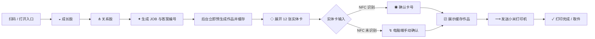
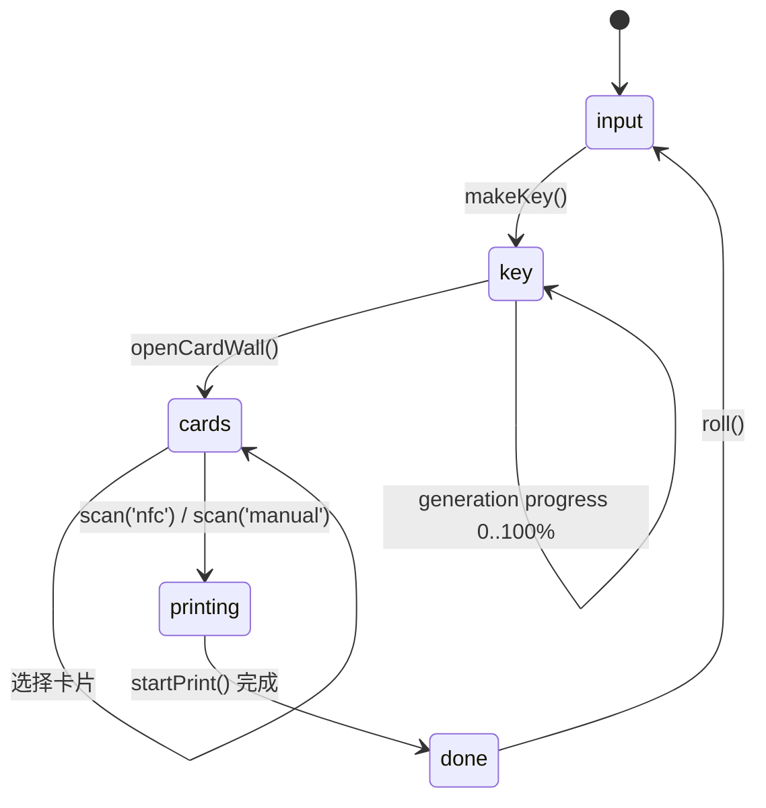
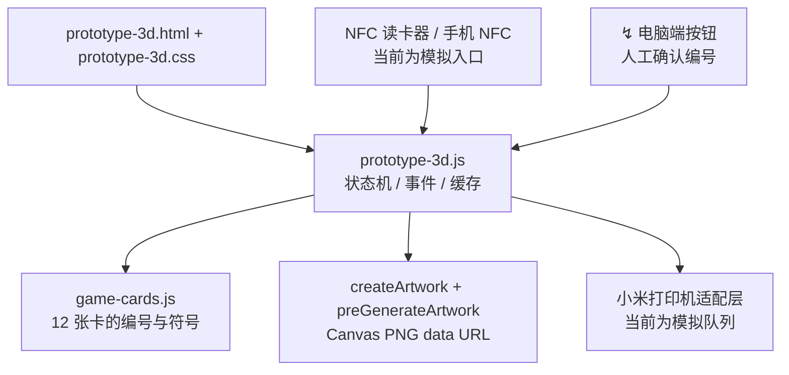

# BETWEEN · 流程与技术架构

这份文档对应电脑端原型 `prototype-3d.html`。视觉层使用符号，文档层保留完整流程、接口和硬件边界，便于协作开发。

## 用户流程

## 状态机

`makeKey()` 先生成 `JOB-*`、答案编号和缓存图片，再切换到钥匙阶段。生成进度只是反馈层；打印动作直接复用 `generation.imageUrl`，不会再次等待生图。

## 技术架构

## 文件职责

| 文件 | 作用 |
| --- | --- |
| `prototype-3d.html` | 电脑端舞台、四个阶段面板、无障碍标签 |
| `prototype-3d.css` | 白色 UI、深色金属卡、符号动效与响应式布局 |
| `prototype-3d.js` | `input → key → cards → printing → done` 主循环、预生成、NFC/Plan B、打印进度 |
| `game-cards.js` | 12 张卡的数据、编号、颜色与机制 |
| `SYMBOL-DESIGN-SYSTEM.md` | 符号词典、视觉规则、状态顺序 |
| `server.mjs` | 本地静态服务器，默认端口 `4187` |

## 手机与电脑的连接边界

手机负责扫码进入同一个 `JOB-*` 会话；电脑端是现场主控，保存答案编号、卡片选择和缓存作品。正式接入时，手机和电脑之间需要一个局域网或云端会话服务：

1. 手机扫码 `sessionId`，向服务端写入 `input` 结果。
2. 电脑端通过 WebSocket/SSE 收到 `key`、`card`、`print` 事件。
3. NFC 读卡器把卡片 UID 映射到 `01—12`，服务端只接受当前 `JOB-*` 的目标编号。
4. 识别失败时，电脑端 `↯` 按钮走同一个 `scan('manual')` 接口。

## 小米打印机适配点

原型已把“发送到小米打印机”作为独立动作，打印内容来自预生成缓存。真实部署时只需替换打印适配层：把 `imageUrl` 转成小米打印机 SDK 或局域网协议需要的图片格式，并回传 `queued / printing / done / error` 状态；上层状态机不变。

