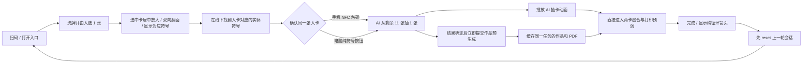
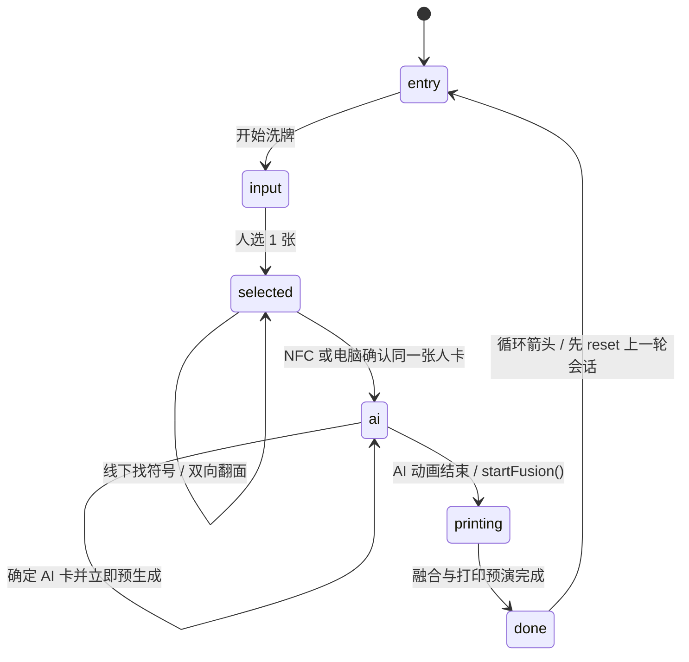
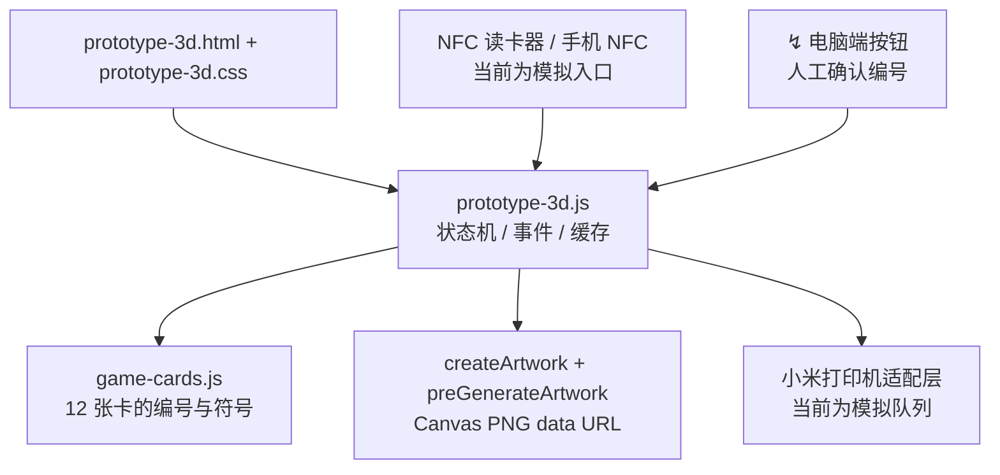
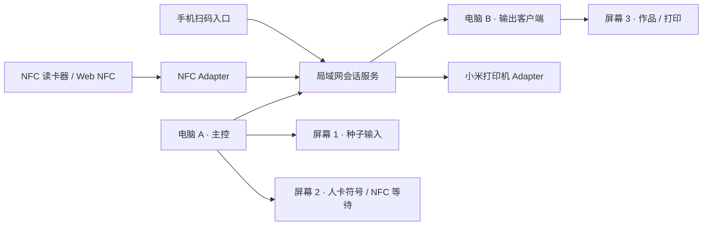

# BETWEEN · 流程与技术架构

这份文档对应电脑端原型 `prototype-3d.html`。视觉层使用符号，文档层保留完整流程、接口和硬件边界，便于协作开发。

## 用户流程



## 状态机



`handOverToAI()` 确定第二张卡后立即调用 `createJob(cards, requestId)`，与抽卡动画并行。动画结束由 `startFusion()` 直接承接同一任务；没有第三张答案卡、钥匙说明页或第二次找符号。预生成尚未完成时显示动态符号，完成后沿用该作品进入预演，不重复提交。`restartExperience()` 先等待上一轮会话 `reset()`，再回到入口。

常态页面与按钮只显示符号，无障碍标签保留；必要错误、真实打印状态及明确授权的最终问题揭晓允许文字。3D 预演完成与实物出纸分别确认。

## 技术架构

以下多屏与硬件适配图保留扩展设计意图，不代表全部设备已接通；当前部署和服务边界另见 `cloudflare-backend/README.md`。用户顺序以上面的主流程与状态机为准。



## 两台电脑、三块屏幕的现场部署

把电脑分成“主控”和“输出”两个角色。主控电脑负责唯一的会话状态，输出电脑只订阅状态并渲染，不在本地重新生成作品。三块屏幕使用同一套符号状态，因此任意一块屏幕掉线，主循环仍然可以在主控端完成。



| 角色 | 设备 | 只负责什么 | 推荐入口 |
| --- | --- | --- | --- |
| 主控服务 | 电脑 A | 会话、人卡/AI 卡、预生成缓存、权限和队列 | `server.mjs` + orchestrator |
| 种子输入 | 屏幕 1 | 展示人选卡、线下找符号确认和 AI 抽卡 | `prototype-3d.html?display=input` |
| 符号等待 | 屏幕 2 | 展示人卡对应符号、NFC 等待和纯符号手动确认 | 多屏拆分保留接口 |
| 输出客户端 | 电脑 B | 订阅目标状态、展示预生成图和打印进度 | `prototype-3d.html?display=print` |
| 输出屏 | 屏幕 3 | 只呈现 `▧ → ⟶ → ✓` 三段打印状态 | 由电脑 B 全屏打开 |

当前原型仍可在一台电脑上串行演示四个阶段；`display` 参数是多屏拆分的保留接口。正式部署时，三块屏幕都连到同一个局域网会话服务，不能各自生成随机数或作品。

## 会话与事件契约

每次体验创建一个 `sessionId`，人卡、AI 卡和作品缓存都挂在会话上。线下匹配目标始终是人卡的符号，不计算第三张答案卡。显示端发送用户动作，由会话服务验证当前卡号后更新状态；以下事件总线为扩展示意。

```js
// 所有入口最终都落到同一个事件总线
{
  sessionId: 'JOB-AB12C',
  type: 'input:selected' | 'key:generated' | 'nfc:tag' |
        'card:manual' | 'print:request',
  payload: { growth, relation, cardId, uid, source },
  clientId: 'display-input-01',
  at: 1710000000000
}
```

状态快照至少包含：`stage`、`job`、`selectedCardId`、`generation.status`、`generation.imageUrl`、`print.status`。主控在 AI 结果确定后立刻调用预生成器，把 `imageUrl` 写入会话缓存；打印复用该缓存，不重新生成。

## NFC 与 Plan B 适配接口

NFC 暂时不写死在页面里，保留一个适配器即可接三种输入：桌面 USB 读卡器、安卓 Web NFC、电脑端 `↯` 手动按钮。三者都转换为同一条 `nfc:tag` / `card:manual` 事件，匹配逻辑只比较当前会话的目标 `cardId`。

```js
// 适配器的最小接口，真实硬件接入时替换实现
export function createNfcAdapter({ onTag, onError }) {
  return {
    start() {},                         // USB bridge / Web NFC 在这里启动
    stop() {},
    emit(uid, cardId) { onTag({ uid, cardId, source: 'nfc' }); },
    fail(error) { onError(error); }
  };
}
```

Plan B 确认当前选中的人卡，通过同一会话校验后直接开始 AI 抽卡；不再打开屏幕答案墙。错误卡号、重复确认或上一轮消息不能启动新一次抽卡。

## 打印适配接口

上层只认识队列状态，不依赖小米打印机的具体协议。适配器接收缓存图片和会话编号，回传 `queued → printing → done` 或 `error`；真实接入可以放在电脑 A 或电脑 B，建议放在和打印机同一局域网的电脑 B。

```js
export function createPrinterAdapter({ onStatus }) {
  return {
    async enqueue({ sessionId, imageUrl }) {
      onStatus({ sessionId, status: 'queued' });
      // TODO: replace with Xiaomi SDK / LAN protocol
      onStatus({ sessionId, status: 'printing' });
    },
    cancel() {}
  };
}
```

## 多屏扩展边界（设计参考）

- 每轮体验使用独立会话；下一位开始前先 `reset()` 上一轮，不能用单独刷新页面代替会话关闭。
- 现场演示先用 `nfc` 模拟按钮和 `↯` Plan B，真实 NFC 只替换 adapter，不改状态机。
- 两台电脑正式联机时再把内存状态替换为 WebSocket/SSE 会话服务；不要用跨电脑 `localStorage` 作为同步方案。
- 三块屏幕共享同一个 `JOB-*`，输出屏只显示当前会话，上一位用户完成后由 `↺` 释放会话。

## 文件职责

| 文件 | 作用 |
| --- | --- |
| `prototype-3d.html` | 电脑端舞台、入口/选卡/AI/打印面板、无障碍标签 |
| `prototype-3d.css` | 浅色 UI、印刷卡面、符号动效与响应式布局 |
| `prototype-3d.js` | `input → selected → ai → printing → done` 主循环、预生成、NFC/Plan B、下一轮重置 |
| `game-cards.js` | 12 张卡的数据、编号、颜色与机制 |
| `SYMBOL-DESIGN-SYSTEM.md` | 符号词典、视觉规则、状态顺序 |
| `server.mjs` | 本地静态服务器，默认端口 `4187` |

## 手机与电脑的连接边界

手机扫码进入同一会话；电脑端是现场主控，保存人卡、AI 卡和缓存作品。多屏扩展时，手机和电脑之间共用局域网或云端会话服务：

1. 手机扫码 `sessionId`，向服务端写入 `input` 结果。
2. 电脑端通过 WebSocket/SSE 收到 `key`、`card`、`print` 事件。
3. NFC 读卡器把卡片 UID 映射到 `01—12`，服务端只接受当前 `JOB-*` 的目标编号。
4. 识别失败时，电脑端纯符号按钮确认当前人卡，与手机确认汇入同一次 AI 抽卡流程。

## 小米打印机适配点

原型已把“发送到小米打印机”作为独立动作，打印内容来自预生成缓存。真实部署时只需替换打印适配层：把 `imageUrl` 转成小米打印机 SDK 或局域网协议需要的图片格式，并回传 `queued / printing / done / error` 状态；上层状态机不变。
