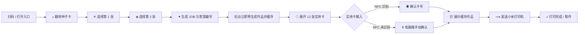
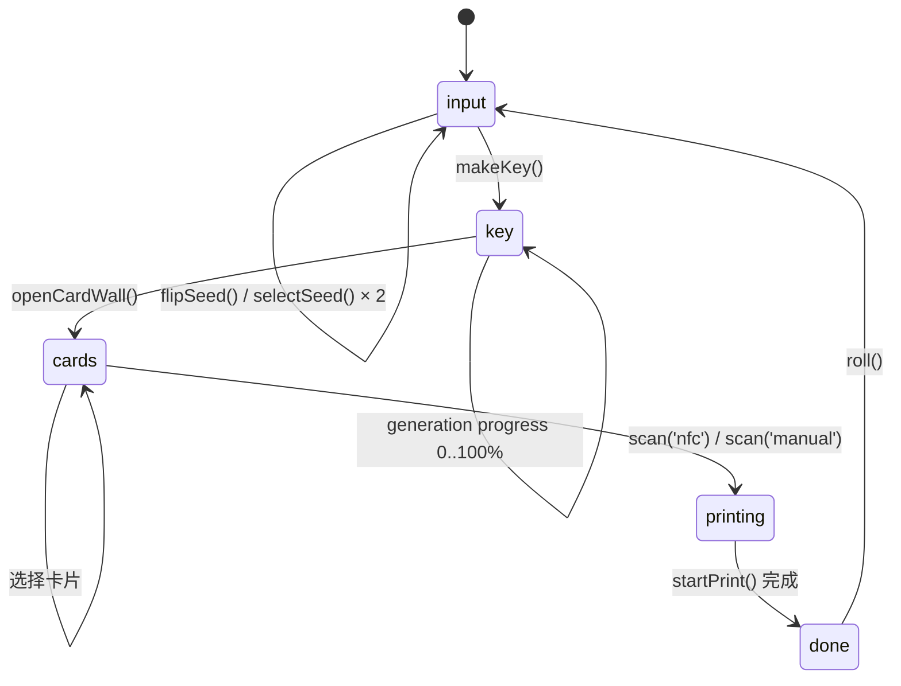
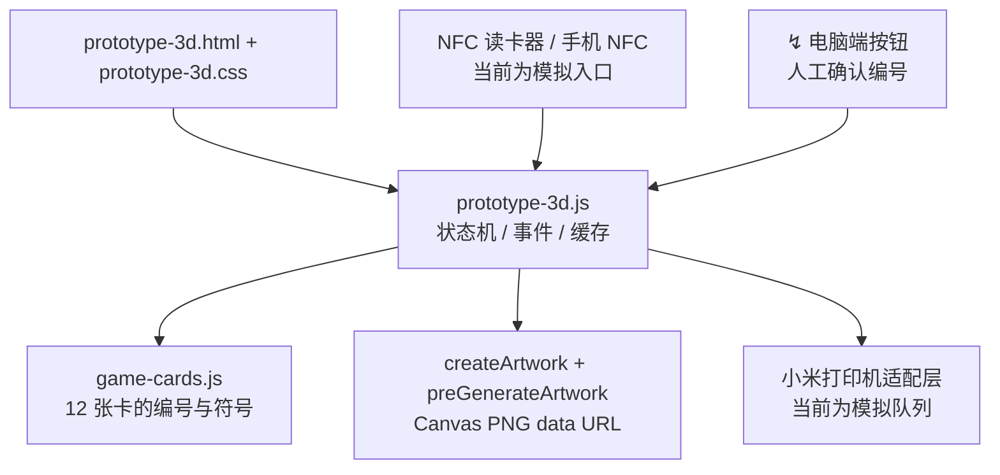
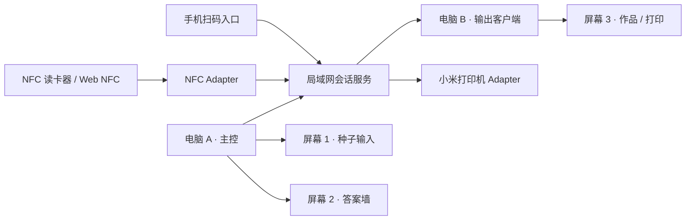

# BETWEEN · 流程与技术架构

这份文档对应电脑端原型 `prototype-3d.html`。视觉层使用符号，文档层保留完整流程、接口和硬件边界，便于协作开发。

## 用户流程



## 状态机



`makeKey()` 先生成 `JOB-*`、答案编号和缓存图片，再切换到钥匙阶段。生成进度只是反馈层；打印动作直接复用 `generation.imageUrl`，不会再次等待生图。

## 技术架构



## 两台电脑、三块屏幕的现场部署

把电脑分成“主控”和“输出”两个角色。主控电脑负责唯一的会话状态，输出电脑只订阅状态并渲染，不在本地重新生成作品。三块屏幕使用同一套符号状态，因此任意一块屏幕掉线，主循环仍然可以在主控端完成。



| 角色 | 设备 | 只负责什么 | 推荐入口 |
| --- | --- | --- | --- |
| 主控服务 | 电脑 A | 会话、随机输入、秘钥、目标卡、预生成缓存、权限和队列 | `server.mjs` + orchestrator |
| 种子输入 | 屏幕 1 | 展示种子翻转、两次选择、秘钥生成反馈 | `prototype-3d.html?display=input` |
| 答案墙 | 屏幕 2 | 展示 12 张符号卡、NFC 等待和 `↯` 手动确认 | `prototype-3d.html?display=cards` |
| 输出客户端 | 电脑 B | 订阅目标状态、展示预生成图和打印进度 | `prototype-3d.html?display=print` |
| 输出屏 | 屏幕 3 | 只呈现 `▧ → ⟶ → ✓` 三段打印状态 | 由电脑 B 全屏打开 |

当前原型仍可在一台电脑上串行演示四个阶段；`display` 参数是多屏拆分的保留接口。正式部署时，三块屏幕都连到同一个局域网会话服务，不能各自生成随机数或作品。

## 会话与事件契约

每次体验创建一个 `sessionId`，秘钥、答案编号和作品缓存都挂在会话上。显示端不直接修改状态，只发送用户动作；主控服务验证动作后广播新的状态快照。

```js
// 所有入口最终都落到同一个事件总线
{
  sessionId: 'JOB-AB12C',
  type: 'input:selected' | 'key:generated' | 'nfc:tag' |
        'card:manual' | 'print:request',
  payload: { growth, relation, cardId, uid, source },
  clientId: 'display-input-01',
  at: 1710000000000
}
```

状态快照至少包含：`stage`、`job`、`answerId`、`selectedCardId`、`generation.status`、`generation.imageUrl`、`print.status`。主控在 `key:generated` 事件完成后立刻调用预生成器，把 `imageUrl` 写入会话缓存；`print:request` 只读取该缓存，不再次等待生成。

## NFC 与 Plan B 适配接口

NFC 暂时不写死在页面里，保留一个适配器即可接三种输入：桌面 USB 读卡器、安卓 Web NFC、电脑端 `↯` 手动按钮。三者都转换为同一条 `nfc:tag` / `card:manual` 事件，匹配逻辑只比较当前会话的目标 `cardId`。

```js
// 适配器的最小接口，真实硬件接入时替换实现
export function createNfcAdapter({ onTag, onError }) {
  return {
    start() {},                         // USB bridge / Web NFC 在这里启动
    stop() {},
    emit(uid, cardId) { onTag({ uid, cardId, source: 'nfc' }); },
    fail(error) { onError(error); }
  };
}
```

Plan B 不绕过校验，也不直接进入打印；它只把用户点击的卡号以 `source: 'manual'` 写入同一验证函数，因此 NFC 未识别时仍保留完整的目标卡匹配和错误反馈。

## 打印适配接口

上层只认识队列状态，不依赖小米打印机的具体协议。适配器接收缓存图片和会话编号，回传 `queued → printing → done` 或 `error`；真实接入可以放在电脑 A 或电脑 B，建议放在和打印机同一局域网的电脑 B。

```js
export function createPrinterAdapter({ onStatus }) {
  return {
    async enqueue({ sessionId, imageUrl }) {
      onStatus({ sessionId, status: 'queued' });
      // TODO: replace with Xiaomi SDK / LAN protocol
      onStatus({ sessionId, status: 'printing' });
    },
    cancel() {}
  };
}
```

## 当前运行边界

- 当前原型默认单用户、单活跃会话；刷新页面即重置会话。
- 现场演示先用 `nfc` 模拟按钮和 `↯` Plan B，真实 NFC 只替换 adapter，不改状态机。
- 两台电脑正式联机时再把内存状态替换为 WebSocket/SSE 会话服务；不要用跨电脑 `localStorage` 作为同步方案。
- 三块屏幕共享同一个 `JOB-*`，输出屏只显示当前会话，上一位用户完成后由 `↺` 释放会话。

## 文件职责

| 文件 | 作用 |
| --- | --- |
| `prototype-3d.html` | 电脑端舞台、四个阶段面板、无障碍标签 |
| `prototype-3d.css` | 白色 UI、深色金属卡、符号动效与响应式布局 |
| `prototype-3d.js` | `input → key → cards → printing → done` 主循环、预生成、NFC/Plan B、打印进度 |
| `game-cards.js` | 12 张卡的数据、编号、颜色与机制 |
| `SYMBOL-DESIGN-SYSTEM.md` | 符号词典、视觉规则、状态顺序 |
| `server.mjs` | 本地静态服务器，默认端口 `4187` |

## 手机与电脑的连接边界

手机负责扫码进入同一个 `JOB-*` 会话；电脑端是现场主控，保存答案编号、卡片选择和缓存作品。正式接入时，手机和电脑之间需要一个局域网或云端会话服务：

1. 手机扫码 `sessionId`，向服务端写入 `input` 结果。
2. 电脑端通过 WebSocket/SSE 收到 `key`、`card`、`print` 事件。
3. NFC 读卡器把卡片 UID 映射到 `01—12`，服务端只接受当前 `JOB-*` 的目标编号。
4. 识别失败时，电脑端 `↯` 按钮走同一个 `scan('manual')` 接口。

## 小米打印机适配点

原型已把“发送到小米打印机”作为独立动作，打印内容来自预生成缓存。真实部署时只需替换打印适配层：把 `imageUrl` 转成小米打印机 SDK 或局域网协议需要的图片格式，并回传 `queued / printing / done / error` 状态；上层状态机不变。
