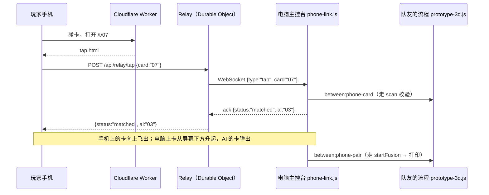

# BETWEEN · 主流程与手机碰卡链路

> 2026-09-13。卡片环节（洗牌、选牌、融合的视觉）由队友负责，见 `prototype-3d.js` 和 `ARCHITECTURE-AND-FLOW.md`。本文件写下定下来的主流程，以及“手机碰卡 → 电脑”这条链路怎么接。

## 主流程

1. AI 洗牌（✋ 手洗 / ▤ 老虎机 / ⟡ 汇聚）。
2. 玩家从洗好的牌里选一张。
3. 玩家在现实里找到这张实体卡。
4. 玩家用自己的手机碰卡上的 NFC：卡从手机“飞”到电脑上，AI 选的另一张卡弹出来。
5. 两张卡融合 → 打印机 → 打印作品。

一共两张牌：玩家一张，AI 一张。

> 现状：队友的代码目前仍是“翻两张种子卡 → 密钥 → 答案墙找卡”。碰卡链路接的是它已有的消息接口，所以队友改成“选一张”之后，链路不用改。

## 链路



| 文件 | 作用 |
| --- | --- |
| `worker/index.js` | Worker：`/t/NN` 返回碰卡页；`/api/relay/*` 转给 Relay；其余走静态文件 |
| `tap.html` | 手机碰卡后打开的页面：显示卡、发送、卡向上飞出，再显示 YOU × AI |
| `phone-link.js` | 主控台端：连 Relay、校验、播放“从手机飞来 + AI 卡弹出”，再交回队友的流程 |
| `wrangler.jsonc` / `.assetsignore` | 部署配置；本地打印后端、超过 25 MiB 的视频不上传 |

手机上会看到的几种结果：

| 结果 | 手机显示 |
| --- | --- |
| 碰对了 | 卡向上飞出 →“已送到大屏”+ 两张卡的符号 |
| 碰错了 | 卡抖一下 →“不是大屏上那张卡” |
| 大屏还没到找卡这一步 | “稍等再碰一次”+ ↻ |
| 大屏没连上 / 6 秒没回应 | “请工作人员在电脑上点 ↯ 确认”+ ↻ |

大屏停在“密钥”那一步时碰卡，会自动打开答案墙再校验。

## NFC 标签

- 每张实体卡背面贴一枚 NTAG213，用 NFC Tools（iOS / 安卓免费）写入 NDEF 网址：`https://<部署域名>/t/01` … `/t/12`。
- iPhone（XS 及以后）亮屏解锁时用机身顶部碰，系统会弹出通知，点一下打开；安卓打开 NFC 开关后用背面中间碰。不需要装 App。
- 标签写入后就不能再改，所以要先定下部署域名再写。

## 兜底

1. 评委自己的手机碰卡。
2. 用你的手机碰同一张卡：网址一样，不用另外开发。
3. 电脑端：队友界面上的 `↯` 确认，再按 `⟲` 配对。这条路没有“从手机飞来”的动效。

## 两种运行方式

| 场景 | 打开 | 能做什么 |
| --- | --- | --- |
| 线上预览 | `https://<部署域名>/prototype-3d.html` | 碰卡可用；打印为模拟（线上没有打印后端） |
| 现场（真打印） | 先跑 `printer/server.py`，再开 `http://127.0.0.1:8765/prototype-3d.html?relay=https://<部署域名>` | 碰卡 + 小米打印机出纸；`?relay=` 只需要第一次，浏览器会记住 |

主控台底部中间的 `⌁` 是连接指示：紫色表示手机碰卡已连通，灰色表示没连上（断开后会自动重连）。

## 给队友的接口

- `phone-link.js` 发出 `between:phone-card {cardId}`（走 `scan`）和 `between:phone-pair {cardId, aiCardId}`（走 `startFusion`），都是 `prototype-3d.js` 已经在监听的消息。
- 同时派发 `window` 事件 `between-pair`，`detail: {card, ai}`。作品要用“玩家卡 + AI 卡”生成时，从这里取两张卡号交给 `createJob`；现在作品仍由两张种子卡生成。
- 配对是否成功，靠 `.cards-panel.matched` 和 `#cardGrid .card.selected` 判断。这两个类名改了，要同步改 `phone-link.js`。
- 隐藏配对（01+02、11+12）在弹出时用金色，和 `prototype-3d.js`、`printer/rarity.py` 的规则保持一致。

## 本地测试

```sh
npx wrangler dev --persist-to <项目外的目录>
```

状态目录不能放在项目里：它在静态文件目录内，每次写入都会让 dev 服务器重载、打断请求。打开 `/tap?card=07` 可以模拟一次碰卡。
