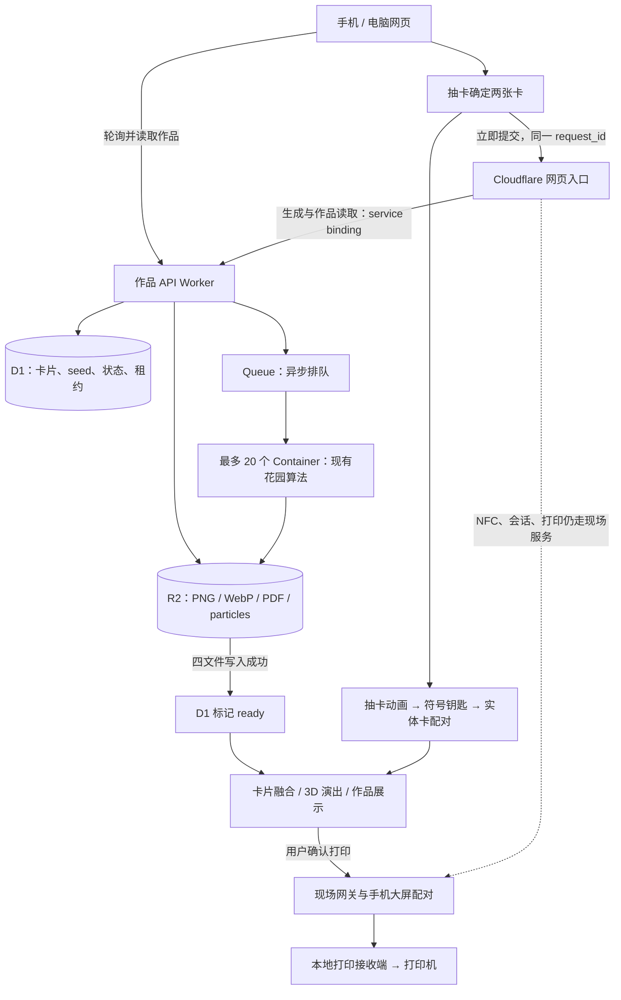

# BETWEEN Cloudflare 交付记录 · 2026-09-13

正式域名已接入 Cloudflare 云生成，可独立生成原算法作品，并保存 PNG、WebP、PDF 和粒子数据。现有画质、卡片顺序与视觉算法保留，抽卡确定后即开始生成。正式域名单件生成与完整下载 14.983 秒通过；**200 人同时完成生成和下载的验收仍未通过。**

## 已发布的入口

| 入口 | 发布状态与证据 |
| --- | --- |
| [云网页预览](https://between-cloud-preview.joeyhu1108.workers.dev) | 完整网页已发布，service binding 接入 production；版本 `53aee6d6-ff74-482b-8e5f-7a736de639fb`。真实 bridge 单件 ready 11.944 秒、完整下载 16.343 秒，11 次请求无失败 |
| [生产作品 API](https://between-artwork.joeyhu1108.workers.dev/api/health) | Worker、D1、Queue、R2、Container 已部署；版本 `f29440ec-6bad-4e2d-a011-5e0a95eca6d9`。单用户真实生成与 WebP / PDF 完整下载校验通过 |
| [正式域名](https://between.zone-y.com) | 已切换云生成，入口版本 `b8739427-3c92-456a-bfed-bb08baf452fa`；`ARTWORK_BACKEND` 绑定 `between-artwork`，现场路由使用恢复后的新 upstream。真实 bridge 单件 ready 12.875 秒、完整下载 14.983 秒，11 次请求无失败 |

Staging 使用独立资源，版本 `5765aa7b-3292-462e-a6e8-093eb921eee2`。生产与 staging 采用相同优化镜像，镜像 SHA-256 为 `2d4122a06c829379081f5bc734c468c4a50ac3172be05fc73cfc12ceb49a9c84`。发布成功、生成成功、浏览器交互完成、实体出纸是四项不同的验收。

## 架构与交互边界

上图生成云路由已用于独立预览与正式域名。云生成不依赖现场电脑计算；现场 NFC 同步和实际打印仍依赖现场服务。云端 `ready` 仅表示四种成品已存储，不能表示打印机已出纸。

当前出图使用既有 Python 算法，没有新增外部 AI 生图调用。最多 20 个计算槽、512 个待处理任务，超限返回可重试排队反馈。任务使用随机 ID 和 seed；同一请求重试复用同一作品，四文件均写入后才公开为 ready，防止将部分上传误报为成品。

## 已完成的提速

- AI 卡片确定即发起生成，与随后约 3.2 秒的抽卡和钥匙动画重叠；后续复用该任务，不重复生成。提前提交不保证每次总等待都恰好缩短 3.2 秒。
- 将算法循环内重复计算移出循环，PNG 使用无损压缩等级 4；保留 1400 × 2400 输出、WebP 质量 88、PDF 内嵌 JPEG 质量 94 及既有粒子规则。
- 每批处理两项队列任务，最多 10 个 consumer 并发；每件作品的四个文件按两项并行上传。
- 固定三组 cards / seed 的离线对照确认粒子、guide、PNG 像素、WebP 一致；固定 PDF 元数据后 PDF 及内嵌 JPEG 一致。该对照不是对所有输入的穷举。

## 实测结果

时间从各用户开始请求起计算；“完整”指 WebP 与 PDF 均下载并通过文件格式、长度与哈希检查，不包含实体打印时间。

| 环境与测试 | ready | 完整下载 | 结论 |
| --- | --- | --- | --- |
| 正式域名，真实 bridge，1 人 | 1/1；12.875 秒 | 1/1；14.983 秒 | 单件通过，11 次请求无失败 |
| 云网页预览，真实 bridge，1 人 | 1/1；11.944 秒 | 1/1；16.343 秒 | 单件通过，11 次请求无失败 |
| Production，真实 bridge，1 人 | 1/1；13.684 秒 | 1/1；32.112 秒 | 单件通过，无请求失败；不能推导 200 人能力 |
| Staging，原测试工具，20 人基线 | 20/20；p95 139.680 秒 | 20/20；p95 141.485 秒 | 本轮通过 |
| Staging，同工具，20 人优化 | 20/20；p95 65.759 秒 | 14/20；6 个 PDF 响应体中断 | 生成就绪更快，但整轮未通过 |
| Staging，真实 bridge，200 人突发 | 200/200；p50 116.155 秒、p95 186.866 秒 | 96/200；104 人失败 | **未通过 200 人验收** |

200 人轮次的首次提交全部成功，无任务 ID 碰撞；200 个任务最终全部 ready。WebP 完整下载 173/200，随后 PDF 完整下载 96/173；共 99 次 HTTP 200 后响应体断流、5 次下载请求网络失败。82 次状态轮询瞬时失败后恢复。下载不额外重试，不能把这些失败从成功率中删除。该轮是一次并发突发，不是持续负载测试，也不是 200 台手机真机测试。

20 人轮次的失败 PDF 随后重新读取均完整，未发现持久文件损坏；仍未定位高并发下载中断发生在哪一段网络。静态资源 200 并发测试也存在下载失败。当前不能将问题直接归因于 Cloudflare、用户网络或测试客户端中的某一方。

本地自动化 41/41 通过（Worker 20、前端恢复 13、提前生成及会话隔离 8）；入口路由另有 15/15 通过。这些验证覆盖请求隔离、幂等、队列恢复、上传失败和路由边界，不替代公网容量、视觉和实体设备验收。

## 交付边界与剩余验收

1. 浏览器视觉：正式域名切换及真实 bridge 生成下载已通过，浏览器内抽卡、融合和 3D 演出的点击与视觉验收仍在进行；HTTP 验证不等于全部画面已验收。
2. 200 人完整下载：定位断流，重新测试同一前端请求策略；记录全部 200 人的成功率与耗时，不能只报告 ready 或成功样本的 p95。
3. 国内外与微信：真实国内外网络、iOS / Android 微信扫码和内置浏览器尚未完成验收。修改 UA、使用本机代理或命令行请求不能替代真机。
4. 实体闭环：网页打印按钮到现场 Printer-6 的出纸曾获用户确认，现场主控和打印接收端现已恢复。用户手机最新仍显示浏览器无法打开网页，尚不能判定为应用 503；现场负责人正在核对 NFC 卡实际 URL。本报告不声称最新云版本已完成 NFC 到打印的全链路实物验收。

## 证据与协作

详细契约、复验命令和运维说明见 [README.md](./README.md)。原始报告在项目上层 `output/cloudflare-backend/`，包括 `canonical-browser-one.json`、`preview-browser-one.json`、`production-browser-one.json`、`staging-20-baseline.json`、`staging-20-optimized.json` 和 `staging-browser-200-final-sanitized.json`；算法对照在 `output/performance/`。分享时使用脱敏统计，原始 job ID、作品能力链接及请求日志不进入公开文档。

协作者自行部署使用自己的 Cloudflare 登录和资源，仓库不交付私人账户凭证。已发布版本及单件验证记录在上表；后续容量、浏览器视觉和实物验证应保留各自独立结果。
