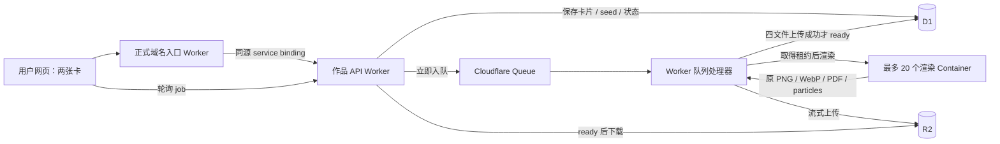

# BETWEEN 云端作品服务

本目录把已有 Python 花园生成算法搬到 Cloudflare，供公网用户各自抽卡、生成、查看和下载作品。目标是 **200 人同时参与**；生成计算采用最多 20 个容器并行，其余任务排队。网页上的 AI 抽卡角色不等于调用外部 AI 生图接口；当前真实出图复用 `printer/server.py`、`garden_style.py`、`rarity.py` 和 `story.py`，**不需要 AI API key**。

## 交付状态 · 2026-09-13

| 项目 | 已核实的状态 |
| --- | --- |
| Worker / Queue / D1 / R2 代码 | 已实现；本地 Worker 测试 16/16、前端请求恢复测试 13/13、抽卡提前生成与会话隔离测试 8/8 通过 |
| 工具链 | 锁定 Wrangler `4.131.1`、`@cloudflare/containers` `0.3.7`；dry-run 通过 |
| 镜像与原算法 | Linux `amd64` Docker 镜像已构建；本地限制 1 CPU 的真实渲染样例 `[12,1] / seed=12345` 用时约 10.94 秒，四种文件生成成功，卡片顺序保持 |
| 本地真实全链路 | Wrangler + Docker 原算法 + 本地 D1 / Queue / R2 已跑通 1 件独立创作；接收 65 ms、ready 21.612 秒、WebP / PDF 下载校验完成 21.775 秒，HTTP 错误 0；另外逐一 GET 四种文件均 200。报告见 `output/cloudflare-backend/local-stream-fixed.json` |
| Cloudflare 账户 | 已在控制台确认 Workers Paid；Containers 列表为空表示尚无应用，不代表必须升级。旧 `cloudchamber/me` 探针的 401 不能作为当前套餐结论 |
| Staging D1 | `between-artwork-staging` 已创建，位置 APAC；ID `ac167554-d825-42bb-8602-4f2566da4006`；schema 已执行成功 |
| Staging Queue | `between-artwork-staging` 已创建 |
| R2 | 账户持有人已开通，`between-artwork-staging` bucket 已实际创建 |
| 云后端端到端 | Staging 已部署至 `https://between-artwork-staging.joeyhu1108.workers.dev`，基线版本 `6d87ed1b-28e7-4991-a49d-27b06f31325f`；首件真实作品 ready 16.382 秒、WebP / PDF 完整下载校验 19.039 秒，无请求失败。正式入口的生成 API 尚未切换 |
| 200 人公网负载 | 未通过验收；静态资源每组 200 并发连接、共 600 GET 出现 44 次失败；改为每组 200 请求 / 最多 20 连接后仍有 12 次卡图下载失败。小并发两种网络路径各 10 次完整成功，暂未确定高并发断流原因。本地 200 次提交逻辑测试不代表云上吞吐 |
| 国内外 / 微信 | 尚未完成国内外真实网络与微信群扫码、微信内浏览器真机验收；浏览器修改 UA 不能替代真机 |

`https://between.zone-y.com` 的静态页面已经在 Cloudflare，不等于本目录的云生成后端已经上线。正式网站原来的生成接口仍有本机隧道路由，只有完成下文的 service binding 切换及实测后，才能宣称公网出图摆脱本机依赖。现场 NFC、手机与大屏配对、CUPS / 小米打印机出纸不属于本 Worker。

## 流程与职责



绑定名称与配置来源均在 [wrangler.jsonc](./wrangler.jsonc)：

| 绑定 / 配置 | 用途 |
| --- | --- |
| `DB` | D1 保存任务、幂等键、原始卡片顺序、seed、计算租约和最终 manifest |
| `GENERATION_QUEUE` | 消息只携带 job ID；每批 1 条，最大 consumer 并发 20，队列投递重试配置 100 |
| `RENDERER` / `ArtworkRenderer` | job ID 稳定散列到 `renderer-0` 至 `renderer-19`，每个容器同时只渲染一件作品 |
| `ARTWORKS` | R2 保存四种成品；不公开 bucket，文件通过 Worker 按 job ID 读取 |
| `standard-2` / `max_instances:20` | 当前每槽配置 1 vCPU、6 GiB 内存、12 GB 磁盘；上限是最多 20 个按需启动实例，不是预先常驻 20 台。[官方规格与计费](https://developers.cloudflare.com/containers/platform/pricing/) |
| `sleepAfter:'60s'` | 无活动后休眠；SDK 保留在途请求，长渲染不会仅因超过 60 秒而作为闲置关停 |
| 每分钟 cron | 修复 D1 已写入但 Queue 发送中断，以及处理进程退出后失效的租约 |

任务状态为 `queued → generating → ready / failed`。`queued + generating` 总数最多 512，由一条 D1 `INSERT … SELECT` 原子检查；并发提交不能突破该上限。已完成与失败任务不占待生成容量。20 个计算槽和 512 件任务上限解决的是资源与排队边界，不能直接推导出每位用户的等待时间。

Queue 至少一次投递可能出现重复消息。Worker 通过 D1 原子租约取得唯一处理权，租约持续 6 分钟，每次文件上传前续租。`429 busy` 退避，不消耗业务失败次数；其他计算或上传错误最多尝试 5 次。任务从创建起超过 30 分钟仍未完成，下一次取得处理权时会进入可查询的 `failed`，而不是永远转圈。重试始终保留原 cards / seed / ID；容器暂存丢失后可按原输入重算。

四个文件全部写入 R2 后才发布 `ready`。Container 代理返回的流需按 Content-Length 包装 `FixedLengthStream`，恢复 R2 所需的已知长度标记；上传和传输同时等待，失败时取消管道，避免整图占用 Worker 内存。上传中断留下的部分文件不能通过公开接口读取；成功后清理容器暂存，最终失败也会尽力清理部分对象。D1 和 R2 是持久结果，容器磁盘不是归档。[FixedLengthStream 官方说明](https://developers.cloudflare.com/workers/runtime-apis/streams/transformstream/)

## 对外兼容契约

| 请求 | 返回与约束 |
| --- | --- |
| `GET /api/health` | `{ok, backend:"cloudflare", generator:"local_garden", max_concurrent_renders:20}`；检查 D1 与绑定存在，不启动付费渲染，也不证明容器和 R2 已完成真实读写验收 |
| `POST /api/jobs` | 仅接受 `{cards:[human,ai], request_id}`；首次 `201 queued`，相同输入重试 `200` 返回同一任务 |
| `GET /api/jobs/:id` | 返回持久状态；ready 时含原算法 params / story / rarity / style 与下载路径；失败时提供 `error` |
| `GET / HEAD /printer/jobs/:id/artwork.png` | 原始 PNG |
| `GET / HEAD /printer/jobs/:id/artwork.webp` | 网页预览 |
| `GET / HEAD /printer/jobs/:id/artwork.pdf` | 可下载 PDF；文件就绪不表示已经发送实体打印 |
| `GET / HEAD /printer/jobs/:id/particles.json` | 三维演出使用的原粒子数据 |

请求示例：

```json
{"cards":[12,1],"request_id":"95c940b7-d8f6-4676-820a-1f74b38df294"}
```

- cards 必须是两个不同的整数，范围 1–12。`params.cards` 保持 `[human,ai]` 原顺序；`params.m / n` 是算法使用的升序模态，不能用来反推是谁先抽卡。
- request_id 使用 `crypto.randomUUID()` 生成的 UUID v4，或 `crypto.getRandomValues()` 生成的 16 字节、32 位十六进制文本。重新请求同一创作必须沿用原 key。改变卡片后沿用旧 key 返回 409。不要用递增编号、时间戳或 `Math.random()` 替代随机能力标识。
- 浏览器只发两张卡和 request_id，不上传 m / n / a / b / seed。Worker 生成 128 位随机 job ID，以及 unsigned 32-bit seed；`0` 至 `4294967295` 都是合法 seed。任务 ID 兼容 `SG-YYYYMMDD-数字-8HEX`。
- `image / pdf / particles` 均为 `/printer/jobs/:id/...` 同源相对路径。最终 `style_version` 为原算法当前的 `garden-v1.1`，兼容现有打印场景的 `garden-v1` 检查。`print_status` 固定为 `not_submitted`。
- 请求 JSON 最大 4096 字节；额外字段拒绝。非法格式 400，内容过大 413，非 JSON 415；Origin 存在时必须与请求 URL 同源，不提供跨域 CORS 放行。
- 512 个名额已满时，新 key 返回 `429`、`Retry-After:30` 和 `retry_after:30`，不创建任务。已有 key 不受满队列影响。D1 已保存但暂时未能发入队列时返回 503 和原 ID，cron 会恢复；客户端重试保持相同 key。
- 状态 JSON 不缓存；成品当前按 `private, max-age=86400` 返回。请求编号和作品链接视作可访问该作品的能力信息，不应放入公开日志或共享测试截图。

主流程应等到 ready 才调用 `mountPrinterScene(job)`。本轮前端已将独立 `/printer/` 的创建格式迁移为 cards 契约，主流程与打印页补了 crypto 随机编号回退，`bridge.js` 等待窗口调整为 30 分钟。发布前仍需检查最终构建和浏览器完整流程，不能仅凭单元测试判断微信真机兼容。

## 本地验证

以下命令从 `seed-universe/cloudflare-backend` 执行。Node 24 可运行使用内置 SQLite 的测试；Docker 需要运行。

```sh
npm ci
npm test
npm run check
```

`npm test` 共 37 项。Worker 的 16 项使用真实 SQLite 执行生产 SQL，R2 / Queue / Container 是测试绑定，没有调用线上服务；包括 200 个独立请求、520 次并发提交中的 512 容量上限、同 key 幂等与冲突、uint32 边界、原序卡片、重复投递、上传中断、固定长度流的截断 / 超长拒绝、失效租约恢复和日志能力标识脱敏。前端的 13 项读取实际 bridge / printer 函数，验证断网与 503 后同 key / 同 job 恢复、30 分钟截止、UUID 兼容、采用真实参数，以及终态失败后新创作。另 8 项验证抽卡时立即提交、3.2 秒后才进入钥匙和 NFC 阶段、只提交一次、同编号重试、废弃会话的旧请求和轮询不能覆盖新会话。`npm run check` 是 Wrangler dry-run；编译成功不是实际资源已建好或已经上线。

可复验镜像：

```sh
docker build --platform linux/amd64 -f container/Dockerfile -t between-renderer:local ..
docker run --rm --platform linux/amd64 --cpus=1 -p 127.0.0.1:8080:8080 between-renderer:local
```

容器接口、原算法隔离和 Python HTTP 测试见 [container/README.md](./container/README.md)。Docker 的构建上下文明确排除真实作品目录、SQLite 数据库和凭证，不要改为 `COPY .`。

Worker 本地服务使用独立的模拟 D1 / R2 / Queue，以及本机 Docker：

```sh
npm run db:local
npx wrangler dev --local --port 8799 --test-scheduled
```

在第二个终端执行：

```sh
curl --fail http://127.0.0.1:8799/api/health
node load-test.mjs --base http://127.0.0.1:8799 --users 1 --output ../../output/cloudflare-backend/local-one.json
curl --get http://127.0.0.1:8799/__scheduled --data-urlencode 'cron=* * * * *'
```

以上是供接手人复验的操作步骤；本轮实际本地 Worker 全链路使用端口 `18887`，保存了表格中记录的 1 人报告。不能把本地结果写成“公网压测已通过”。

## Staging 部署与负载验收

1. 使用当前账户登录并核对 `npx wrangler whoami`。账户已经是 Workers Paid，无需因为旧 API 的 401 重复升级。协作者自行部署时使用自己的 Cloudflare 账户和资源 ID，仓库配置不包含登录凭证。
2. 当前账户的 R2、D1 和 Queue 均已创建，不要重复创建。以下命令仅供在协作者自己的账户中初始化新的独立环境。

   ```sh
   npx wrangler r2 bucket create between-artwork-staging
   ```

3. 检查 [wrangler.jsonc](./wrangler.jsonc) 四种绑定名称、D1 ID、Queue 名称、container class、迁移标签及每分钟 cron。D1 schema 已在 staging 执行；后续需要重建独立测试环境时才对正确目标执行 `npm run db:remote`，不要清空现有正式数据。
4. `npm run deploy` 部署 staging，保存 Wrangler 返回的实际 URL、版本 ID 和时间；不要预先假定 workers.dev 子域名。检查 Container 镜像发布、应用状态和所有资源绑定后，再 GET `/api/health`。
5. 用实际 staging origin 先生成 1 件，再逐级扩大到 20 / 200 件，保存各轮报告。示例中的域名是占位符，必须替换；压测会真实计算、写 D1 / R2，产生相应用量。

   ```sh
   node load-test.mjs --base https://STAGING-ORIGIN --users 1 --output ../../output/cloudflare-backend/staging-one.json
   node load-test.mjs --base https://STAGING-ORIGIN --users 20 --output ../../output/cloudflare-backend/staging-20.json
   node load-test.mjs --base https://STAGING-ORIGIN --users 200 --output ../../output/cloudflare-backend/staging-200.json
   ```

压测默认 1 人，显式 `--users 200` 才会生成 200 个独立任务；最长运行 10 分钟。它检查每位用户的 ID / cards / seed 稳定与隔离，轮询 ready，下载 WebP / PDF，验证 MIME、文件头、长度并记录 SHA-256、错误率和 p50 / p95 / max。不会调用 NFC、会话或实体打印接口。`passed:true` 表示这一轮任务全部完成且下载验证通过；还应记录瞬时失败、重试次数、排队时间以及是否超过体验可接受等待，不能只看最后成功数。

200 人验证至少保留：200 个独立任务 ID、200 份 WebP 与 PDF 的下载记录、没有卡片串号、队列排空、Cloudflare 错误与资源峰值、真实成品抽样。脚本不验证画面审美、手机帧率或实体出纸。国内外不同网络、iOS / Android 微信内点击、微信群二维码与回到页面后的恢复另行验收；本机命令行压测不能替代这些项目。

## 切换正式域名

现有入口 Worker 在项目上层的 `cloudflare/`，负责静态页面与正式域名。先完成 staging 验收，再准备独立正式资源及 `between-artwork` 后端配置；保持 staging 数据与正式作品分开。可以从当前配置复制正式配置，逐一替换 Worker、D1、R2 和 Queue 名称 / ID；不要把占位 ID 直接发布。

在正式入口的 Wrangler 配置加入 HTTP service binding，例如：

```json
{"services":[{"binding":"ARTWORK_BACKEND","service":"between-artwork"}]}
```

在入口 Worker 的旧隧道分支前，使用明确路由表把以下请求转给云作品服务：`/api/health`、`/api/jobs`、`/api/jobs/:id` 和本 README 的四种作品文件路径。核心转发为：

```js
return env.ARTWORK_BACKEND.fetch(request);
```

保留原请求 URL、Origin、方法、body 与后端缓存头；不需要改成后端 workers.dev 域名，也不能沿用旧代理把 Origin 改成隧道域名，否则同源检查会拒绝。HTTP service binding 支持直接转发完整 Request。[官方写法](https://developers.cloudflare.com/workers/runtime-apis/bindings/service-bindings/http/)

`/api/sessions/*`、`/api/nfc/*`、`/api/printers`、`/api/jobs/:id/print` 及打印接收端仍属于现场设备服务，不能整体把 `/api/*` 都交给本 Worker。保留现场路由时，明确公开线上作品与现场旧任务使用哪个后端；两个独立数据库不会自动共享旧 job ID。正式入口必须保留 HTTPS 跳转，API 错误不缓存，未知 API 不应回落成 HTML。

从项目上层目录重建并发布入口，锁定同一 Wrangler 版本：

```sh
node cloudflare/build.mjs
seed-universe/cloudflare-backend/node_modules/.bin/wrangler deploy --config cloudflare/wrangler.jsonc
```

最终从 `https://between.zone-y.com` 重新完整体验一次：抽卡 → 同一个 request_id 建任务 → queued / generating → ready → 两张卡融合 → 3D 演出 → 下载原作品。核对 `/api/health` 显示 cloudflare，并在受控验收中确认生成链路不再调用 Mac 隧道。保存入口与后端版本 ID 便于回退；回退不要删除已经写入 D1 / R2 的作品。

## 费用与运维边界

当前没有外部 AI 按图收费。主要用量来自容器有效 CPU 时间、存活期间配置的内存 / 磁盘、Queue 操作、D1 读写、R2 存储及操作、Worker / Durable Object 请求与日志。容器休眠会停止相应计算资源计费；60 秒闲置窗口以及重试仍影响用量。20 个槽全部启动时配置合计为 20 vCPU / 120 GiB 内存 / 240 GB 磁盘；这是容量配置，不是承诺每月固定费用。CPU 按有效使用，内存和磁盘按配置资源及运行时间计费。[Containers 价格](https://developers.cloudflare.com/containers/platform/pricing/)

估算需要实际每张图的容器存活时间、CPU 用量、四文件总字节数、每天创作数、保存天数、轮询次数、重试与下载量。每个成品至少四次对象写入；忙碌退避和重复投递也会增加队列操作。[Queues 价格](https://developers.cloudflare.com/queues/platform/pricing/) D1 的状态轮询与租约续期会产生读写。[D1 价格](https://developers.cloudflare.com/d1/platform/pricing/) R2 的 `$0` 开通金额不代表后续无限使用免费，应按当前存储及操作计费与账户剩余额度核算。[R2 价格](https://developers.cloudflare.com/r2/pricing/)

本地 1 CPU 的 10.94 秒样例不能线性推算成 Cloudflare 200 人承诺；冷启动、槽位散列碰撞、文件上传和地区网络都会影响最终等待。512 队列上限约束同时积压，不是月账单硬上限。目前没有自动删除已完成作品的保留策略，成品会持续占用存储；上线运营前确定保存周期和预算，后续删除策略必须同时处理 D1 状态与 R2 文件，避免发出已失效下载链接。

监控应区分请求被接受、真实出图 ready、文件可下载、三维演出完成和实体纸张打印。发现生成失败时查 Worker / Container 日志、队列积压与最老任务年龄；cron 是恢复机制的一部分，不能停用后仍宣称任务可自动恢复。若 R2 或渲染不可用，返回可见排队 / 失败状态，不能用固定样张伪装生产生成成功。
